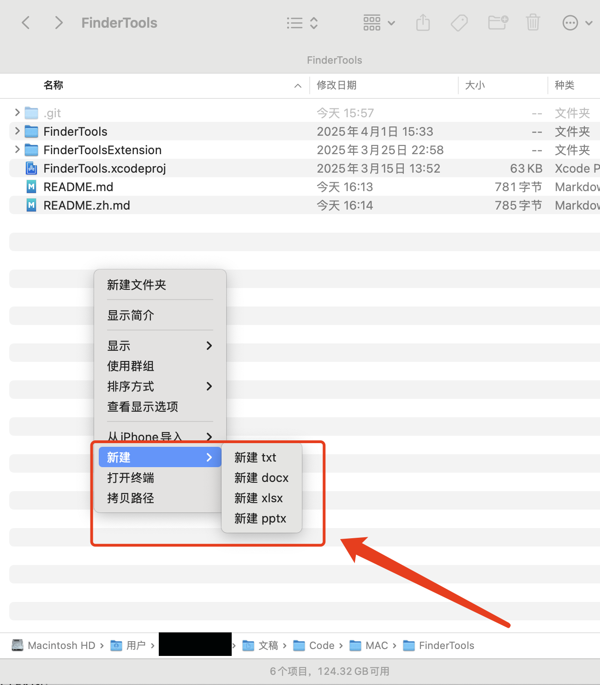

# FinderTools

一款极简的 macOS Finder 右键扩展工具，无需任何配置即可使用。

⚡ 极简macOS右键扩展：
- 无需配置
- 无需权限
- 无冗余

## 核心优势
- 🎯 **功能极致精简** - 只保留最常用的3个功能
- 🛡️ **零权限要求** - 完全不需系统授权
- 📦 **单文件运行** - 无后台进程/依赖项

## 功能
- 📄 新建空白文件：`.txt`、`.docx`、`.xlsx`、`.pptx`
- 💻 在当前目录打开终端
- 📋 复制文件/文件夹路径到剪贴板

## 安装方法
1. 下载最新版本
2. 将 `FinderTools.app` 拖拽到 `/应用程序` 文件夹
3. 首次运行激活（可能需要重启 Finder）

## 使用方法
在任意 Finder 窗口或桌面右键点击即可使用工具。

## 卸载方法
1. 从 `/应用程序` 中删除 `FinderTools.app`
2. 重启 Finder（在终端输入 `killall Finder`）

## 系统要求
- 支持 macOS 13.5+ • 完全沙盒化

## 截图
 <!-- 请在此处添加你的截图 -->

