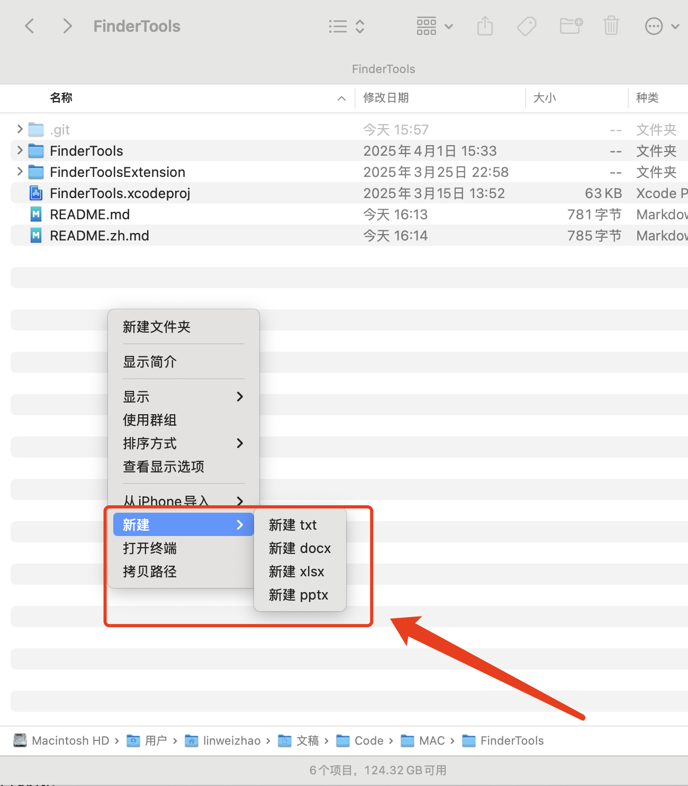

# FinderTools

A minimal macOS Finder right-click extension that adds essential tools without any configuration.

## Features
- 📄 New blank files: `.txt`, `.docx`, `.xlsx`, `.pptx`
- 💻 Open Terminal at current directory
- 📋 Copy file/folder path to clipboard

## Installation
1. Download the latest release
2. Drag `FinderTools.app` to your `/Applications` folder
3. Launch once to activate (may need to restart Finder)

## Usage
Simply right-click in any Finder window or on desktop to access the tools.

## Uninstall
1. Delete `FinderTools.app` from `/Applications`
2. Restart Finder (`killall Finder` in Terminal)

## Requirements
- macOS 13.5 Catalina or later

## Screenshot
 <!-- Add your screenshot here -->

